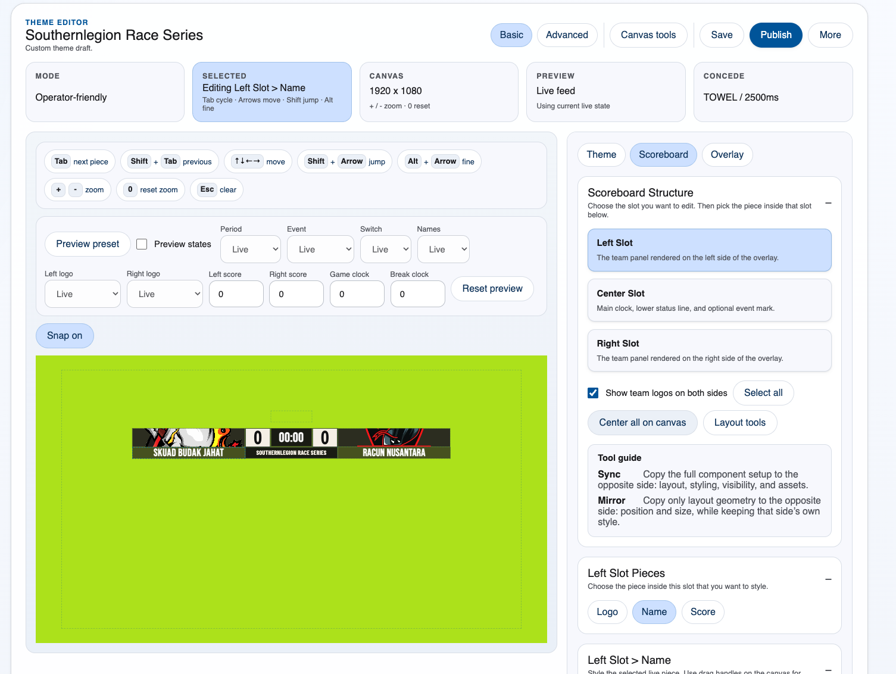

# PBResults Scoreboard

Browser-based scoreboard control, team resolution, and overlay tooling for PBResults live feeds.

This project is built for paintball broadcast workflows where PBResults provides the upstream `/live` data and the overlay is consumed as a browser source in tools like vMix.

## Why this exists

The default PBResults scoreboard is too basic for broadcast use and does not offer much flexibility in look and feel.


This project exists to add:

- custom scoreboard styling and layout control
- stronger broadcast presentation
- team logo handling
- live operator resolution for difficult team names
- a workflow that fits real event production instead of a fixed stock scoreboard

## Visual example

### Live overlay output


### Theme editor



## What it does

- polls a PBResults `/live` feed
- normalizes live state for overlays and operator UI
- provides an operator-first live control page at `/admin/operations`
- lets you build and publish scoreboard themes
- manages team registry, aliases, and learned live match names
- resolves uncertain or truncated live team names during production
- exports/imports full app state, teams, and themes
- packages a Windows portable build for one-click operator use

## Main pages

- `/admin/operations`
  - live health
  - team resolution
  - readiness and warnings
- `/admin/themes`
  - theme management and editor
- `/admin/teams`
  - team registry, logos, aliases, live match names
- `/admin/settings`
  - upstream URL, publishing, polling, backup/import
- `/overlay/live`
  - live overlay output for OBS/vMix/browser source use

## Tech stack

- Fastify
- React
- Vite
- TypeScript
- Zod
- Sharp

## Requirements

- Node.js 22
- pnpm 10

The repo includes one-click helper scripts for macOS and Windows dev setup:

- `setup.command`
- `setup.bat`
- `run.command`
- `run.bat`

## Local development

```sh
pnpm install
pnpm build
pnpm dev
```

Helpful commands:

```sh
pnpm test
pnpm build
pnpm dev
pnpm package:windows:portable
```

The dev launcher opens the admin UI in your browser and prints the selected ports.

## Runtime data

This repo does **not** track live/runtime state.

These are generated locally and ignored:

- `data/settings.json`
- `data/themes.json`
- `data/teams.json`
- `data/assets.json`
- `data/operations.json`
- `data/uploads/*`
- `logs/*`
- `dist/*`

On first server start, the app bootstraps missing data files automatically.

The default upstream URL is intentionally generic:

```text
http://127.0.0.1:5000
```

Change it in `/admin/settings` for your PBResults environment.

## Windows portable packaging

This repo supports a Windows portable release format for operator machines.

Build command:

```sh
pnpm package:windows:portable
```

Important:

- portable packaging must be built on Windows or Windows CI
- the packaged app opens `/admin/operations`
- operators use `/overlay/live` as the vMix browser source

See also:

- [SETUP.md](./SETUP.md)
- [docs/project-context.md](./docs/project-context.md)
- [docs/api-reference.md](./docs/api-reference.md)

## Documentation

- [docs/project-context.md](./docs/project-context.md)
  - architecture, runtime assumptions, team resolution, packaging model
- [docs/api-reference.md](./docs/api-reference.md)
  - route-by-route API surface and important response shapes
