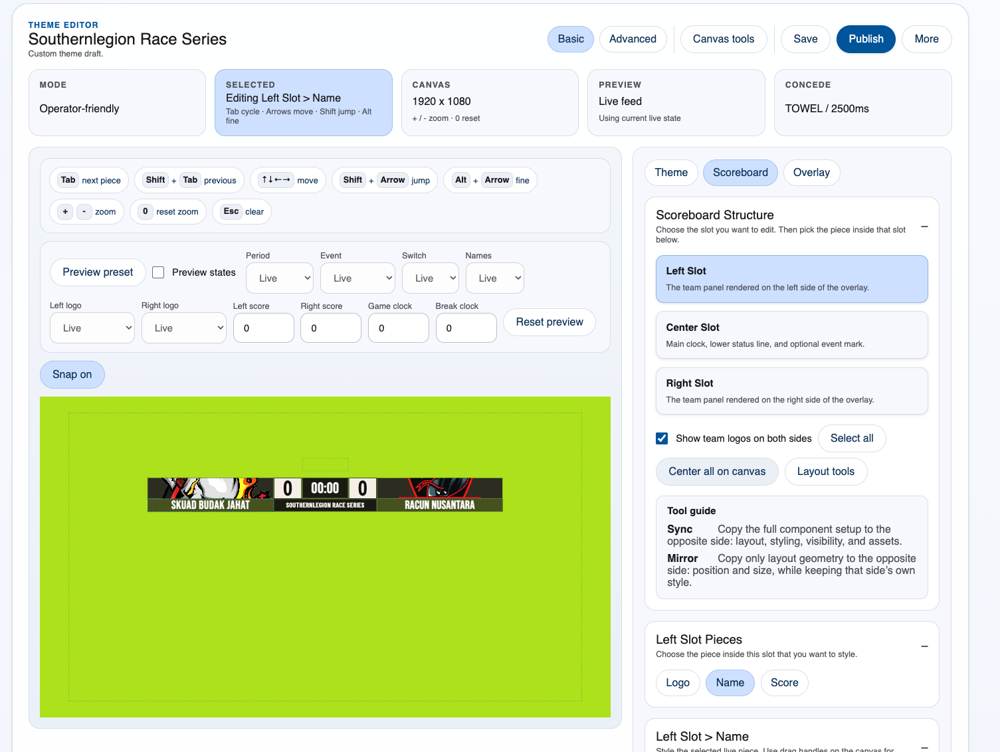

# PBResults Scoreboard

Browser-based scoreboard control, team resolution, and overlay tooling for [PBResults](https://www.paintballresults.com/) live feeds.

This project is built for paintball broadcast workflows where PBResults provides the upstream `/live` data and the overlay is consumed as a browser source in tools like vMix.

## Why this exists

The default PBResults scoreboard is too basic for broadcast use and does not offer much flexibility in look and feel.


This project exists to add:

- custom scoreboard styling and layout control
- stronger broadcast presentation
- team logo handling
- live operator resolution for difficult team names
- a workflow that fits real event production instead of a fixed stock scoreboard

## Visual example

### Live overlay output


### Theme editor



## What it does

- polls a PBResults `/live` feed
- normalizes live state for overlays and operator UI
- provides an operator-first live control page at `/admin/operations`
- lets you build and publish scoreboard themes
- supports designer-created free text and image layers
- exposes operator-controlled text with explicit Take and Reset actions during live production
- manages team registry, aliases, and learned live match names
- resolves uncertain or truncated live team names during production
- exports/imports full app state, teams, and themes
- packages a Windows portable build for one-click operator use
- checks, verifies, installs, health-checks, and rolls back Windows portable updates
- refreshes configuration across open admin tabs and overlays through typed SSE invalidations

## Main pages

- `/admin/operations`
  - live health
  - team resolution
  - readiness and warnings
- `/admin/themes`
  - theme management and editor
- `/admin/teams`
  - team registry, logos, aliases, live match names
- `/admin/settings`
  - upstream URL, publishing, polling, backup/import, software updates
- `/overlay/live`
  - live overlay output for OBS/vMix/browser source use

## Tech stack

- Fastify
- React
- Vite
- TypeScript
- Zod
- Sharp

## Requirements

- Node.js 22
- pnpm 10

The repo includes one-click helper scripts for macOS and Windows dev setup:

- `setup.command`
- `setup.bat`
- `run.command`
- `run.bat`

## Local development

```sh
pnpm install
pnpm build
pnpm dev
```

Helpful commands:

```sh
pnpm test
pnpm build
pnpm dev
pnpm package:windows:portable
```

The dev launcher opens the admin UI in your browser and prints the selected ports.

## Runtime data

This repo does **not** track live/runtime state.

These are generated locally and ignored:

- `data/settings.json`
- `data/themes.json`
- `data/teams.json`
- `data/assets.json`
- `data/operations.json`
- `data/uploads/*`
- `logs/*`
- `dist/*`

On first server start, the app bootstraps missing data files automatically.

The default upstream URL is intentionally generic:

```text
http://127.0.0.1:5000
```

Change it in `/admin/settings` for your PBResults environment.

## Windows portable packaging

This repo supports a Windows portable release format for operator machines.

Build command:

```sh
pnpm package:windows:portable
```

Important:

- portable packaging must be built on Windows or Windows CI
- the packaged app opens `/admin/operations`
- operators use `/overlay/live` as the vMix browser source
- Settings checks the official stable GitHub Release feed automatically by default
- downloads are verified against the release manifest and SHA-256 before staging
- installation always requires local confirmation and creates a stopped-state data snapshot
- failed health checks restore the previous application and data snapshot automatically

See also:

- [SETUP.md](./SETUP.md)
- [docs/project-context.md](./docs/project-context.md)
- [docs/api-reference.md](./docs/api-reference.md)

## Creating a release

Maintainers can start a complete Windows release from a clean, synchronized `main` branch:

```sh
pnpm release 1.7.0
```

The command validates the version and repository, runs the local checks, creates the annotated `v1.7.0` tag, and pushes only that tag. The tag triggers GitHub Actions, which builds the Windows portable package, validates its manifest and SHA-256, creates the matching GitHub Release, attaches both the versioned ZIP and update manifest, and publishes it.

The first release containing the managed updater must still be installed using the earlier manual `app/` replacement process. Starting it once bootstraps the stable root launcher; later updater-protocol-1 releases can then be installed from Settings.

Useful options:

```sh
pnpm release 1.7.0 --dry-run
pnpm release 1.7.0 --yes
pnpm release 1.7.0 --skip-checks
```

Manual runs of the Windows workflow create an Actions artifact for testing but do not publish a GitHub Release.

Versioning convention:

- new feature: increment the minor version, such as `1.6.0` to `1.7.0`
- bug fix: increment the patch version, such as `1.7.0` to `1.7.1`
- breaking compatibility or data change: increment the major version

## Documentation

- [docs/project-context.md](./docs/project-context.md)
  - architecture, runtime assumptions, team resolution, packaging model
- [docs/api-reference.md](./docs/api-reference.md)
  - route-by-route API surface and important response shapes
- [docs/planned-next-features.md](./docs/planned-next-features.md)
  - prioritized operational roadmap for updates, backups, and secure remote configuration
- [docs/automatic-updates-technical-plan.md](./docs/automatic-updates-technical-plan.md)
  - implementation-grade plan for managed Windows portable updates and rollback
- [docs/remote-access-technical-plan.md](./docs/remote-access-technical-plan.md)
  - implementation-grade plan for temporary ngrok remote access and its security boundary
